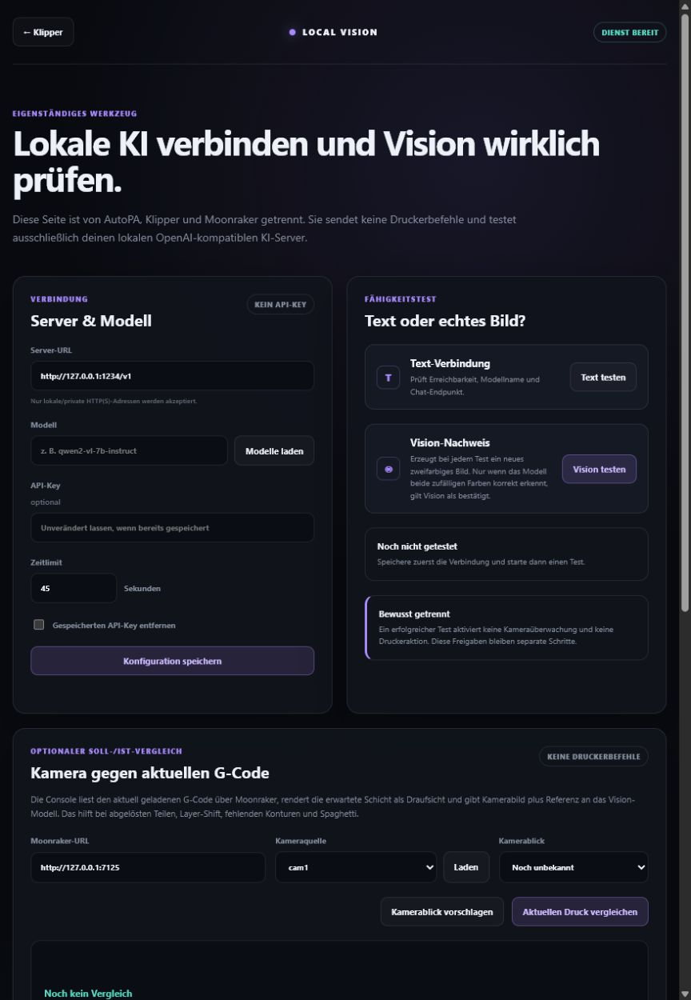

# Local Vision for Klipper

[English](README.md) | [Deutsch](README.de.md) | [Changelog](CHANGELOG.md)

Local Vision is an independent, local-first vision and analysis companion for
Klipper/Moonraker printers. It is deliberately separate from AutoPA and does
not require load-cell or accelerometer hardware.



## Features

- configure an OpenAI-compatible local LLM server;
- verify text and real image understanding;
- discover Moonraker snapshot cameras;
- store or estimate the camera viewpoint;
- compare a camera snapshot with a rendered view of the current G-code layer;
- explain completed AutoPA result files as an optional read-only integration;
- monitor prints with conservative consecutive-detection gates;
- notify Home Assistant through a private webhook after a confirmed print
  failure, allowing Home Assistant to send a mobile notification.

The web console is read-only except for one supervised workflow: explicitly
confirmed camera calibration may issue normal `G28` homing and slow in-bounds
measurement moves. The optional monitor keeps printer actions disabled unless
both command-line interlocks are supplied.
The Home Assistant webhook ID is stored as a secret and is never returned to
the browser. The web console includes a dedicated test notification.

## Install on RatOS or generic Klipper

```sh
cd ~/LocalVision
sh scripts/install.sh
printf '%s\n' '<sudo-password>' | sh scripts/install-mainsail-integration.sh
```

Direct URL:

```text
http://<printer-ip>:7127/
```

Mainsail URL:

```text
http://<printer-ip>/local-vision/
```

## Test

```sh
PYTHONPATH=src python3 -m unittest discover -s tests -v
```

See [console documentation](docs/LOCAL_VISION_CONSOLE.md) and
[monitor documentation](docs/VISION_MONITOR.md).
